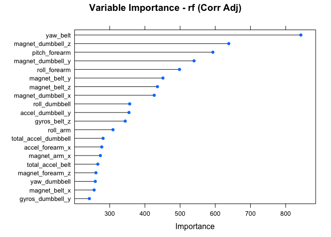

# Machine Learning: Evaluate Weight Lifting
Eward Harris  
Aug 13, 2017  


## Executive Summary  
**Background** 
Using devices such as Jawbone Up, Nike FuelBand, and Fitbit it is now possible to collect a large amount of data about personal activity relatively inexpensively. These type of devices are part of the quantified self movement – a group of enthusiasts who take measurements about themselves regularly to improve their health, to find patterns in their behavior, or because they are tech geeks. One thing that people regularly do is quantify how much of a particular activity they do, but they rarely quantify how well they do it.  


**Analysis Goal**  
In this project, your goal will be to use data from accelerometers on the belt, forearm, arm, and dumbell of 6 participants. They were asked to perform barbell lifts correctly and incorrectly in 5 different ways. More information is available from the website here:  
<http://groupware.les.inf.puc-rio.br/har>  (see the section on the Weight Lifting Exercise Dataset). 

## Data Processing

**Load Data into R**  

```r
train.file = "https://d396qusza40orc.cloudfront.net/predmachlearn/pml-training.csv"
test.file = "https://d396qusza40orc.cloudfront.net/predmachlearn/pml-testing.csv"

training <- read.csv(train.file, header = TRUE, 
                  na.strings = c("NA","N/A","NULL","Null","null",""," ","  ","#DIV/0!"))
testing <- read.csv(test.file, header = TRUE, 
                  na.strings = c("NA","N/A","NULL","Null","null",""," ","  ","#DIV/0!"))
dim(training)
dim(testing)
```

```
## [1] 19622   160
## [1]  20 160
```


**Partition Training Data Set**  
To allow for a validation of the models to occur before evaluating predictive accuracy on test set, a validation set, is created.  Due to the limited size of the testing set, 20 observations, this validation set will afford another opportunity to evaluate the prediction model.  As defined in code below, the original training set is split 70% training/30% validation. 

```r
set.seed(100)
inTrain = createDataPartition(training$classe, p = 0.7, list = FALSE)
training = training[inTrain,]
validation = training[-inTrain,]
dim(training) 
```

```
## [1] 13737   160
```

```r
dim(validation) 
```

```
## [1] 4124  160
```


## Exploratory Data Analysis  
There is a total of 160 variables in the data sets.  To avoid overfitting, we want to identify important or relevant variables, or features, that may contribute significantly to greater predictive capability of a model.   A first step is to identify and remove features with a percentage of observations values equal NA or blank is 80% or higher.  The assumption is that the high percentage of NA or blank values raises some concern about the quality or completeness of information obtained.  More research is required before further considering these variables for inclusion in the model. This may include better populating values across all observations.  
**Remove Variables with High Percentage 'NA'**   

```r
pctNA <- sapply(training, function(x) round(sum(is.na(x))/nrow(training),3))
lowNA <- names(pctNA)[pctNA < 0.80]   ## Exclude column names with 80%+ NA
```

**Remove Unnecessary Variables**  
The analysis focuses on the data produced by the various accelerometers, not the individuals and/or time related to the data.  To avoid these items influencing our model, they are excluded here.

```r
## Removes variables referencing the user, observation (row index), and date/time
lowNA.remove <- lowNA[1:7]
lowNA.remove
```

```
## [1] "X"                    "user_name"            "raw_timestamp_part_1"
## [4] "raw_timestamp_part_2" "cvtd_timestamp"       "new_window"          
## [7] "num_window"
```


**Highly Correlated Variables**  
Some models benefit by excluding those variables that are highly correlated.  Here we identify those variables with a correlation above 0.80.  We will run our models, with and without these highly correlated variables, to evaluate model performance.  

```r
train.corr <- training[, keep1]   ## Variables before considering correlation
var.corr <- cor(train.corr)
highly.corr <- findCorrelation(var.corr, cutoff = 0.80)  ## Correlation > 0.80
keep2 <- names(train.corr[,-highly.corr])   ## Removing NA, Unrelated, & Highly Correlated
corr.excl <- names(train.corr[,highly.corr])
corr.excl
```

```
##  [1] "accel_belt_z"     "roll_belt"        "accel_belt_y"    
##  [4] "accel_dumbbell_z" "accel_belt_x"     "pitch_belt"      
##  [7] "accel_dumbbell_x" "accel_arm_x"      "magnet_arm_y"    
## [10] "gyros_forearm_y"  "gyros_dumbbell_x" "gyros_dumbbell_z"
## [13] "gyros_arm_x"
```


**Variables evaluated to fit model (including correlated)**  

```
##  [1] "roll_belt"            "pitch_belt"           "yaw_belt"            
##  [4] "total_accel_belt"     "gyros_belt_x"         "gyros_belt_y"        
##  [7] "gyros_belt_z"         "accel_belt_x"         "accel_belt_y"        
## [10] "accel_belt_z"         "magnet_belt_x"        "magnet_belt_y"       
## [13] "magnet_belt_z"        "roll_arm"             "pitch_arm"           
## [16] "yaw_arm"              "total_accel_arm"      "gyros_arm_x"         
## [19] "gyros_arm_y"          "gyros_arm_z"          "accel_arm_x"         
## [22] "accel_arm_y"          "accel_arm_z"          "magnet_arm_x"        
## [25] "magnet_arm_y"         "magnet_arm_z"         "roll_dumbbell"       
## [28] "pitch_dumbbell"       "yaw_dumbbell"         "total_accel_dumbbell"
## [31] "gyros_dumbbell_x"     "gyros_dumbbell_y"     "gyros_dumbbell_z"    
## [34] "accel_dumbbell_x"     "accel_dumbbell_y"     "accel_dumbbell_z"    
## [37] "magnet_dumbbell_x"    "magnet_dumbbell_y"    "magnet_dumbbell_z"   
## [40] "roll_forearm"         "pitch_forearm"        "yaw_forearm"         
## [43] "total_accel_forearm"  "gyros_forearm_x"      "gyros_forearm_y"     
## [46] "gyros_forearm_z"      "accel_forearm_x"      "accel_forearm_y"     
## [49] "accel_forearm_z"      "magnet_forearm_x"     "magnet_forearm_y"    
## [52] "magnet_forearm_z"
```


## Model Selection
As our outcome variable 'classe' is qualitative, a linear model does not make sense. We will be using the models listed below to predict the outcome.  

* Recursive Partitioning (rpart)  
* Generalized Boosted Regression (gbm)  
* randomForest (rf)  

A combined, or stacked, model was considered.  However, due to the results of these defined models, the 'potential' improvement in accuracy does not outweigh the loss of explanatory capability presented by the stacked model.  

**Prediction Models**  
Below is code used for the prediction model / methods.  This code uses data that includes highly correlated variables.  To understand the effects of the highly correlated variables, this same code was applied to data sets that excluded these varaiables as well.  


**Cross Validation**  
The purpose or goal of cross validation is to minimize the generalization error.  As a model is built or developed on training set data, it may not apply as well to another data set.  This is often the result of overfitting the model on the training set.  To control for this generalization error, two approaches were applied:  

1. apply cross validation within each model (resampling)  
2. evaluate model performance on 'validation' set before applying to testing set.  


```r
set.seed(100)
fitCtrl <- trainControl(method = "cv", number = 5, search = "random", 
                        returnResamp = "all", savePredictions = "all",
                        classProbs = TRUE, selectionFunction = "best", trim = TRUE)
fitRPart1 <- train(classe ~ ., data = training[ , c("classe", keep1)], method = "rpart", 
                  tuneLength = round(sqrt(ncol(training[,c("classe",keep1)]))), 
                  trControl = fitCtrl, metric = "Accuracy")
predRPart1 <- predict(fitRPart1, newdata = validation[ ,c("classe", keep1)])
confuseRPart1 <- confusionMatrix(predRPart1, validation$classe)

set.seed(100)
fitCtrl <- trainControl(method = "cv", number = 5, search = "random",
                        returnResamp = "all", savePredictions = "all",
                        classProbs = TRUE, selectionFunction = "best", trim = TRUE)
gbmGrid <- expand.grid(.interaction.depth = 1,
                   .n.trees = seq(10,50,by=10),
                   .shrinkage = 0.1, .n.minobsinnode=2)
fitGBM1 <- train(classe ~ ., data = training[ , c("classe", keep1)], method = "gbm", 
                  tuneGrid = gbmGrid, trControl = fitCtrl,
                  metric = "Kappa", verbose = FALSE)
predGBM1 <- predict(fitGBM1, newdata = validation[ ,c("classe", keep1)])
confuseGBM1 <- confusionMatrix(predGBM1, validation$classe)

set.seed(100)
fitCtrl <- trainControl(method = "oob", number = 5, search = "random",
                        returnResamp = "all", savePredictions = "all",
                        classProbs = TRUE, selectionFunction = "best", trim = TRUE)
mtry <- c(1:round(sqrt(ncol(training[,c("classe",keep1)]))))
rfGrid <- data.frame(.mtry = mtry)
fitRF1 <- train(classe ~ ., data = training[ , c("classe", keep1)], method = "rf", 
                  tuneGrid = rfGrid, trControl = fitCtrl, 
                  metric = "Accuracy", importance = FALSE)
predRF1 <- predict(fitRF1, newdata = validation[ ,c("classe", keep1)])
confuseRF1 <- confusionMatrix(predRF1, validation$classe)
```


## Model Performance  
We use Accuracy as our measure of the performance or quality of a prediction.  Essentially, we calculate the number of correct predictions to the total number of predictions.  Measuring the 'Accuracy' on the training set is not appropriate.  We apply the model to the validation set (see results below) to evaluate the 'Accuracy' of the model.  


**Model Accuracy**  
We compare the accuracy of each method with and without the highly correlated varibles.  The 'AccuracyCorr' reflects the accurracy of the model excluding the highly correlated variables.    

```r
Method <-  c("Rpart", "Boosting", "randomForest")
AccuracyTtl <- c(round(confuseRPart1$overall[1],3), 
                        round(confuseGBM1$overall[1],3), 
                        round(confuseRF1$overall[1],3))
AccuracyCorr <- c(round(confuseRPart2$overall[1],3), 
                        round(confuseGBM2$overall[1],3), 
                        round(confuseRF2$overall[1],3))
model.accuracy <- data.frame(cbind(Method, AccuracyTtl, AccuracyCorr))
model.accuracy
```

```
##         Method AccuracyTtl AccuracyCorr
## 1        Rpart        0.96        0.956
## 2     Boosting       0.748        0.718
## 3 randomForest           1            1
```


**Variable Importance**  
This function provides a generic method for calculating a variables importance for objects produced by 'train' and method specific methods.  Essentially, a variable with a higher value contributes more significantly to the fit generated by a model.

```r
rpartImp1 <- varImp(fitRPart1, scale = FALSE)
gbmImp1 <- varImp(fitGBM1, scale = FALSE)
rfImp1 <- varImp(fitRF1, scale = FALSE)

rpartImp2 <- varImp(fitRPart2, scale = FALSE)
gbmImp2 <- varImp(fitGBM2, scale = FALSE)
rfImp2 <- varImp(fitRF2, scale = FALSE)
```


Below we see a comparison of top 20 variables for the 'rf' model, with and without variables with a high correlation.

```r
par(mfrow = c(1, 2), mar = c(5, 4, 1, 1))
plot(rfImp1, top = 20, main = "Variable Importance - rf")
```

<!-- -->

```r
plot(rfImp2, top = 20, main = "Variable Importance - rf (Corr Adj)")
```

<!-- -->


## Prediction on Test Set
Upon reviewing the results of the three models, with and without highly correlated variables, there are two main observations:  
1. randomForest (rf) is the most accurate method; although, each model produced reasonably accurate results.  
2. In general, removing highly correlated variables from the model result in slightly less accurate predictive results.  This was not observed for 'rf' model.  
  
**Prediction Results: Random Forest (excluding highly correlated variables)**    

```r
predRF.test <- predict(fitRF2, newdata = testing)
predRF.test.df <- data.frame(obs_id = testing$X, predOutcome = predRF.test)
predRF.test.df
```

```
##    obs_id predOutcome
## 1       1           B
## 2       2           A
## 3       3           B
## 4       4           A
## 5       5           A
## 6       6           E
## 7       7           D
## 8       8           B
## 9       9           A
## 10     10           A
## 11     11           B
## 12     12           C
## 13     13           B
## 14     14           A
## 15     15           E
## 16     16           E
## 17     17           A
## 18     18           B
## 19     19           B
## 20     20           B
```


## Conclusion  
Although each model provides reasonable accuracy for predicting the outcome on the validation set, 'rpart' and 'rf' provide very high accuracy, with 'rf' near perfect.  Additionally, the effect offect of removing highly correlated variables was not significant.  For this reason, the 'rf' model, excluding the correlated variables, is selected to predict the outcome for our testing set.

